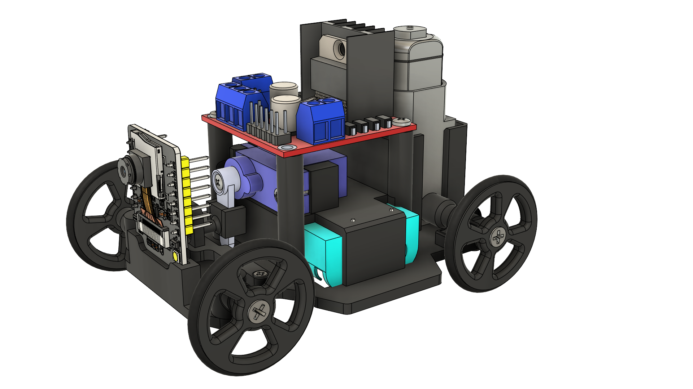

# FPVcar: An Affordable Robotic Platform to Support Computer Vision Education, from Hardware Design to User-Friendly Programming

This repository contains the full source code and 3D design files for the FPVCar project.

FPVcar is a low-cost robotic platform designed to facilitate hands-on Computer Vision and Robotics education, enabling 
users to control a robot through high-level Python commands while receiving real-time video feedback.



## Prerequisites
 - Python 3.6+ and python3-venv.
 - PlatformIO, for firmware deployment. 
 - OpenCV, Websockets and Pandas, for the control software.

## Getting Started

### 1. Clone the Repository

First, clone this repository to your local machine:

```bash
git clone https://github.com/MaVILab-UFV/FPVCar_LARS-2025.git
cd FPVCar_LARS-2025
```

### 2. Firmware Deployment
The firmware can be flashed using PlatformIO either via the VS Code Interface or the command line.

#### Setup Credentials
Before flashing, navigate to `firmware/include/` and update `wifikeys.h` with the desired network credentials.

#### 2.1 Using VS Code Extension
Open the `firmware/` folder in VS Code and click on the PlatformIO icon on the left sidebar. Then, under **Project Tasks**, click **Upload**.

#### 2.2 Using Command Line
If you have PlatformIO Core installed, run the following commands in your terminal:
```bash
cd firmware
pio run --target upload
```
### 3. Software Installation
Follow these steps to create a virtual enviroment and install the fpvcar library:
```bash
# Navigate to the software directory
cd software

# Create and activate a virtual environment
python3 -m venv venv
source venv/bin/activate

# Install build tools and dependencies
pip install wheel setuptools
pip install opencv-python websockets

# Build and install the FPVcar package
python3 setup.py bdist_wheel
pip install ./dist/fpvcar-0.1.2-py3-none-any.whl
```

## Running the FPVCar
After turning on the robot and connecting to the same network, you can run various control scripts. Here is an example:
```python
from fpvcar import FPVCar
from fpvcar.command import MoveForwardStraight, Stop

# Initialize the car with its Access Point IP
car = FPVCar(ip='192.168.4.1')
car.start()

# Example: Move forward
car.run(lambda frame, info: MoveForwardStraight)
```
This repository also provides ready-to-use scripts for validation and testing in the `software/tests/` directory.

## Authors

## Laboratory

## Acknowlwdgements

